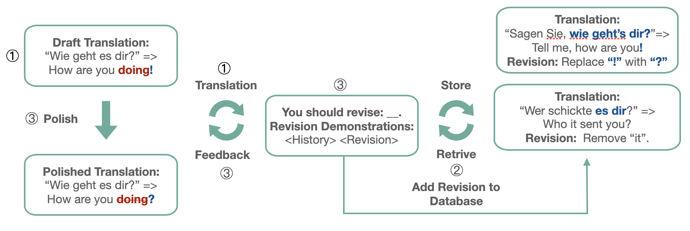

# Human-in-the-loop Machine Translation with Large Language Model (MT Summit 2023)

 

## 1. Overview

  

In this study, we propose a human-in-the-loop pipeline that guides LLMs to produce customized outputs with revision instructions. The pipeline initiates by prompting the LLM to produce a draft translation, followed by the utilization of automatic retrieval or human feedback as supervision signals to enhance the LLM’s translation through in-context learning. The humanmachine interactions generated in this pipeline are also stored in an external database to expand the in-context retrieval database, enabling us to leverage human supervision in an offline setting. We evaluate the proposed pipeline using the GPT-3.5-turbo API on five domain-specific benchmarks for German-English translation. The results demonstrate the effectiveness of the pipeline in tailoring in-domain translations and improving translation performance compared to direct translation instructions. This work was featured in MT Summit 2023.

## 2. Feedback Collection

 - Initial translation results are obtained via `translation_base.py`.
 - Get TER-based generated Feedback via `sacrebleu_patch/sacrebleu.py sacrebleu [ref] -m ter --ter-trace-file op.json < [hypo]`.
 - BM25-RERANK part 

 ## 3. In-context Refinement Translation Pipeline

 - stage1：run `translation_hil.py`.
 - stage2：run `compare_hil.py`.

*All results about the experiment are stored in `experiment_result_data`.

